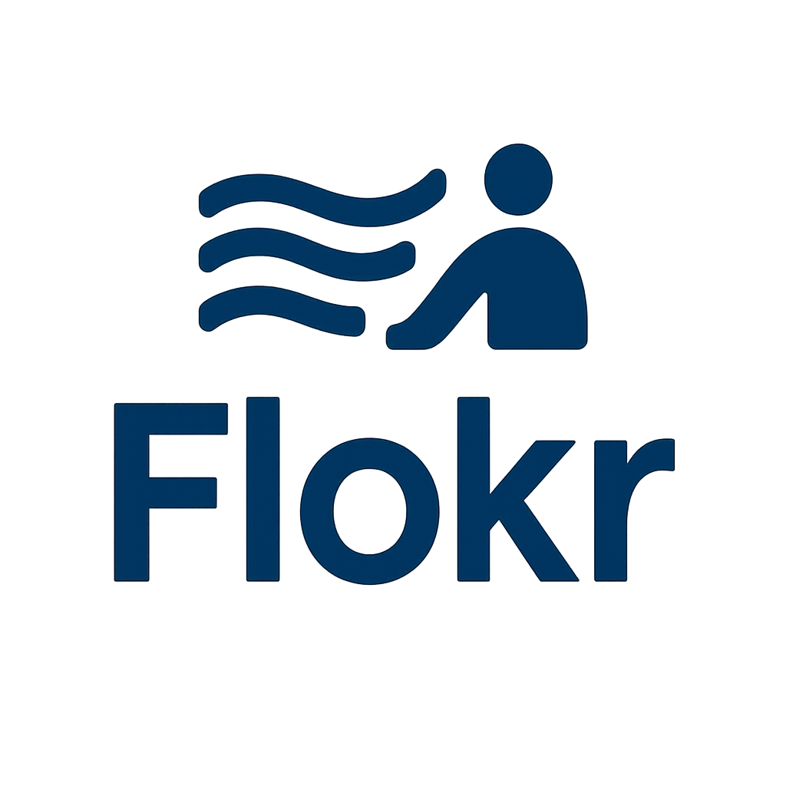
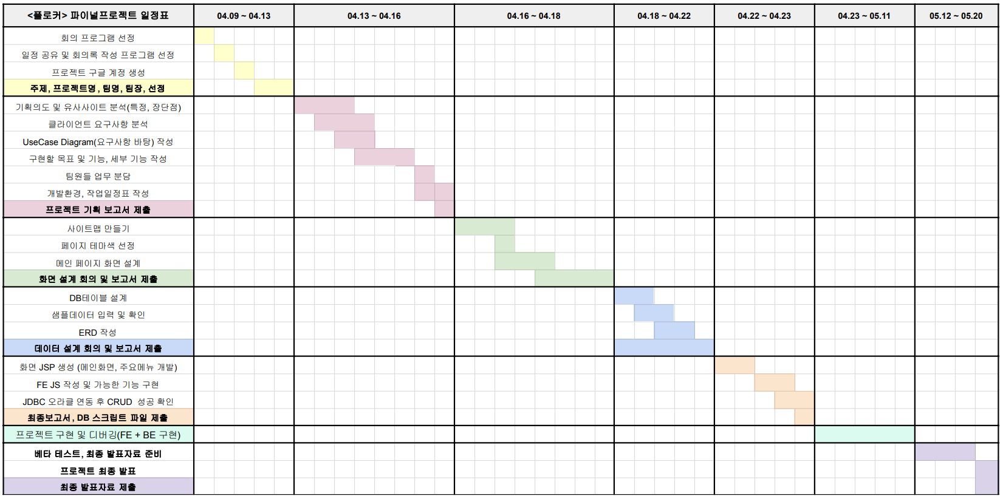
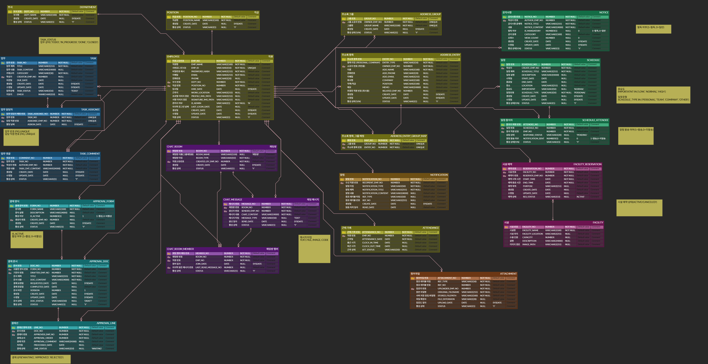
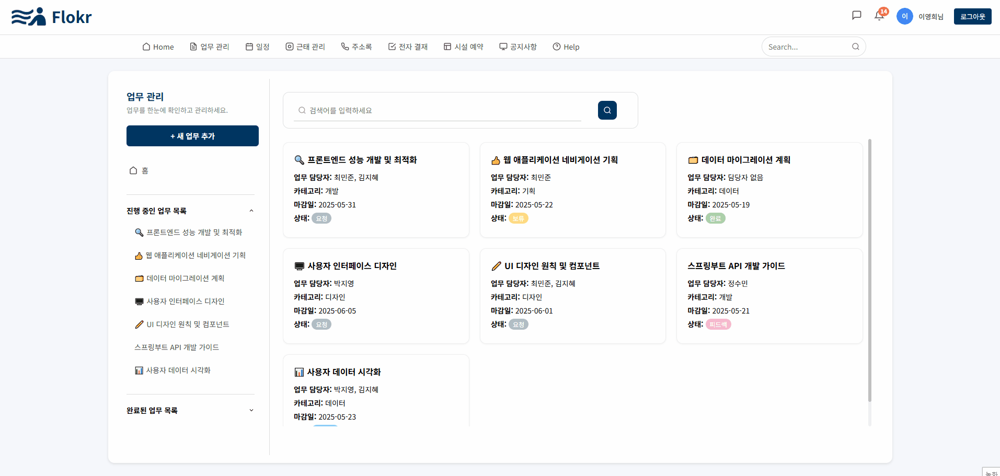
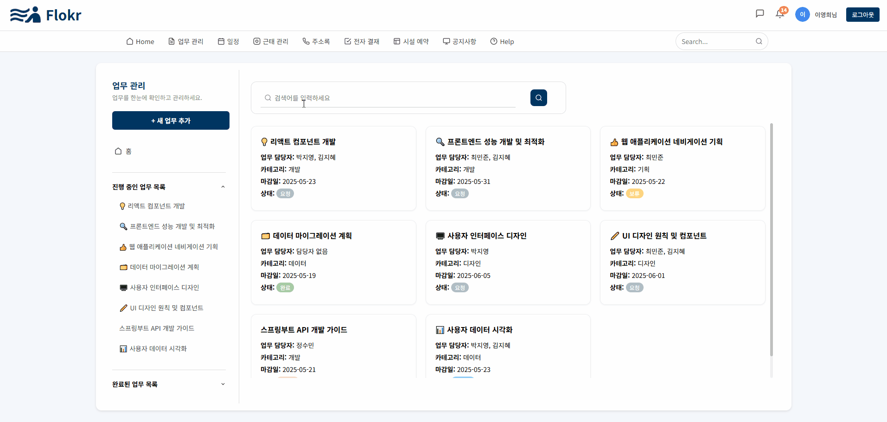
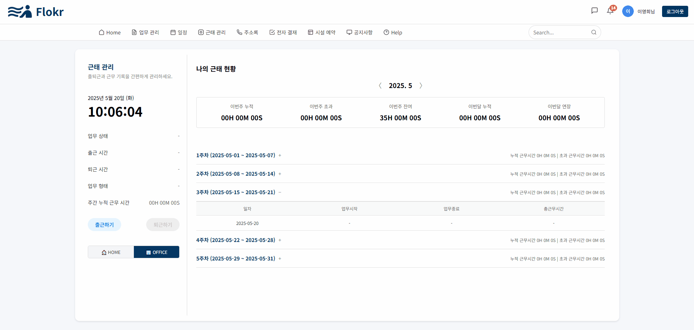
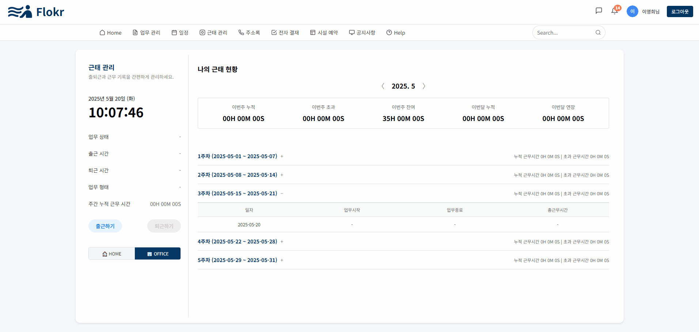

# 🔎 프로젝트 소개

재택과 사무실을 연결하는 통합 올인원 그룹웨어 플로커(Flokr) 

플로커는 하이브리드 워크 시대, 재택과 사무실을 하나로 연결하는 실시간 협업 중심의 통합 그룹웨어 플랫폼입니다. 

현대에는 재택근무와 사무실 근무의 병행이 보편화되면서, 구성원 간 소통과 업무 흐름의 단절, 정보 접근성 저하 등의 문제가 빈번하게 발생하고 있습니다. 
따라서 플로커의 목표는 재택과 오피스 간의 물리적 거리를 극복하고, 하나의 시스템 내에서 모든 협업과 업무 관리를 가능하게 하는 통합 그룹웨어 플랫폼을 구축하는 것입니다. 

#### 주요 목표 
✅ 다양한 근무 형태를 지원하는 일정·근태 통합 관리 
✅ 문서 흐름의 전 과정을 처리할 수 있는 전자결재 시스템 
✅ 부서 및 사용자 간 실시간 소통이 가능한 WebSocket 기반 채팅 및 알림 기능 
✅ 개인화된 정보 관리와 자원 예약 기능을 통한 업무 편의성 제공 
✅ 업무, 결재, 공지, 일정 등 전 영역에 적용되는 고급 검색 기능 제공 

플로커는 장소에 구애받지 않고 하나의 플랫폼에서 업무를 처리함으로써, 업무 효율과 협업 생산성을 높이는 데에 도움을 줍니다. 또한 고급 검색과 통합 시스템 도입을 통해 정보 접근성을 개선하고, 실시간 소통과 유기적인 조직 운영을 가능하게 합니다.

# 📆 개발 기간

#### 2025.04.09 ~ 2025.05.20

*   2025.04.09 ~ 2025.04.13 : 주제 선정, 팀장 선출, 진행 방향 논의
*   2025.04.13 ~ 2025.04.16 : 기획 의도, 유사사이트 분석, 클라이언트 요구사항 분석, UseCase Diagram 작성, 구현 목표 및 세부 기능, 작업 일정표
*   2025.04.16 ~ 2025.04.18 : 사이트맵, Visily툴을 활용한 화면 설계
*   2025.04.18 ~ 2025.04.22 : DB 테이블 설계, 샘플데이터, ERD CLOUD를 활용한 ERD 작성
*   2025.04.22 ~ 2025.04.23 : 화면 JSP 생성, 주요기능 구현, JDBC 오라클 연동 후 CRUD 테스트
*   2025.04.23 ~ 2025.05.11 : 프로젝트 구현 및 디버깅
*   2025.05.12 ~ 2025.05.19 : 베타 테스트, 최종 발표자료 준비
*   2025.05.20 : 프로젝트 최종 발표

# 👨‍💻 구성원 및 역할

### ❤️ 주현수 (조장)

*   업무 관리
    - 업무 추가/수정/삭제
    - 카테고리 선택
    - 이모지 선택 (emoji picker 라이브러리 이용)
    - 공동 작업자 선택
    - 첨부파일 선택
*   근태 관리
    - 출퇴근 실시간 기록
    - 재택 여부 선택
    - 주간/월간 기록 실시간 반영
*   elastic search를 이용한 검색엔진 구현
    - 자동완성
    - 오타 수정
    - 유사어 검색 처리

### 💛 김현지 (조원)

*   ()
*   ()
*   ()

### 🩵 신현정 (조원)

*   ()
*   ()
*   ()

### 💜 이지은 (조원)

*   ()
*   ()
*   ()

# ⚙️ 개발 환경

*   OS : Windows10
*   IDE : STS / VS Code / SqlDeveloper
*   Server : Apach Tomcat 9.0
*   DBMS : Oracle
*   Languages : Java, HTML, CSS, JavaScript, JQuery, JSP, SQL
*   Management : Git, GitHub, SourceTree

# 🛠️ 기술 스택 & 사용 라이브러리

### 🖥️ Front-End

*   HTML5, CSS3, JavaScript
*   jQuery, AJAX, JSON

### ⚙️ Back-End

*   Java 11
*   Spring, MyBatis, Maven
*   Oracle DB

### 📦 기능별 사용 라이브러리

*   😀 이모지 선택: emoji picker
*   📂 파일 업로드: commons-fileupload, cos.jar
*   🔄 JSON 처리: Gson, JSON-simple
*   🗄 DB 연동: Oracle JDBC Driver (ojdbc6)

# 💾 설계

ERD CLOUD:  

# 🎀 프로젝트 구현

### ❤️ 주현수

*   업무 관리
    
    

*   검색 엔진
    
    

*   근태 관리 (사무실)
    
    

*   근태 관리 (재택)
    
    

### 💛 김현지

### 🩵 신현정

### 💜 이지은

# 📚 최종 보고서

[Flokr 최종보고서 🎈](https://drive.google.com/file/d/1eLBI3Lt7UkVynXvdukT1v017RzVeII4E/view?usp=drive_link)
